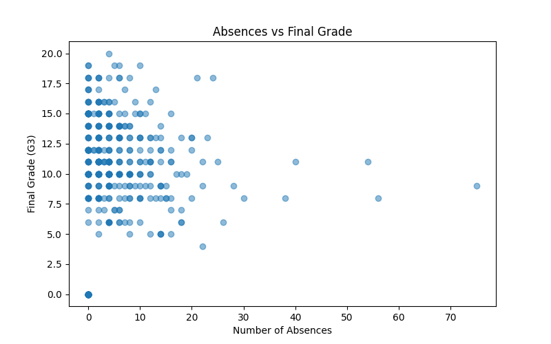
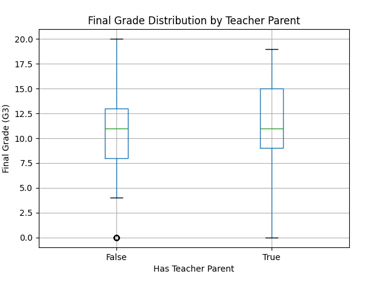
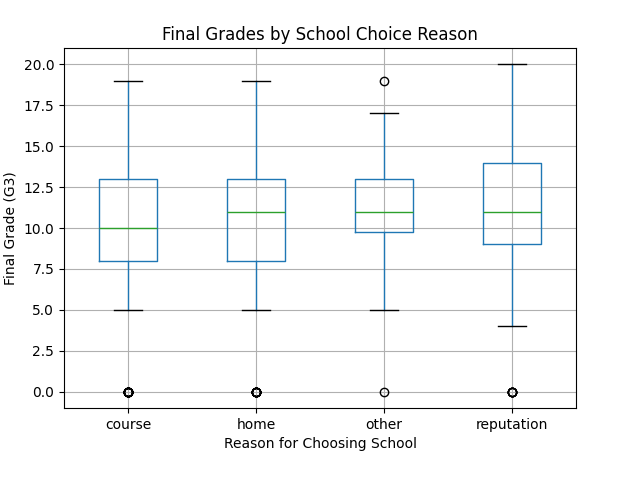
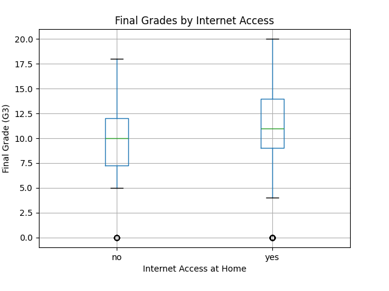
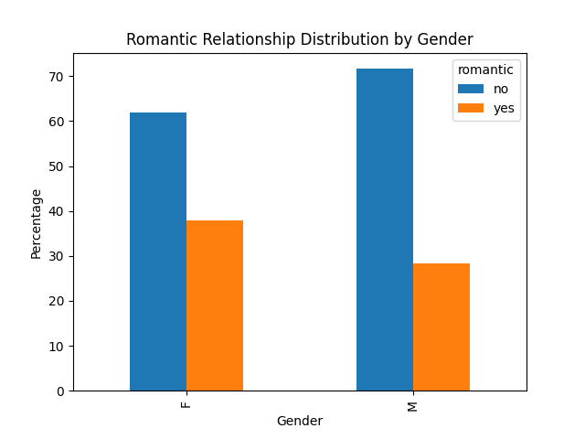

# Student Performance EDA

Exploratory Data Analysis (EDA) project using the UCI Student Performance Dataset.

This project analyzes how academic, social, and family-related factors may relate to student performance in mathematics.

---

# Dataset

Source:
UCI Machine Learning Repository — Student Performance Dataset

Files used:
- `student-mat.csv`
- `student-por.csv`

The dataset contains:
- demographic information
- family background
- study habits
- alcohol consumption
- relationship status
- school support
- academic grades

Target variable:
- `G3` → Final Grade

---

# Technologies Used

- Python
- Pandas
- Matplotlib

---

# Concepts Demonstrated

## Data Analysis
- Exploratory Data Analysis (EDA)
- Correlation Analysis
- Grouped Statistical Analysis
- Feature Engineering
- Hypothesis Testing

## Pandas Skills
- `groupby()`
- boolean filtering
- `.corr()`
- `.mean()`
- `.unique()`
- `pd.crosstab()`
- sorting and aggregation

## Visualization
- Scatter plots
- Box plots
- Bar charts

---

# Questions Explored

Some of the questions investigated:

- Does study time improve grades?
- Do absences correlate with performance?
- Do students with teacher parents perform better?
- Do female students outperform male students?
- Does being in a romantic relationship affect performance differently across genders?
- Does internet access relate to academic outcomes?
- Which school-choice motivations are associated with stronger performance?

---

# Key Findings

- `G2` (second period grade) strongly predicts final grade (`G3`)
- Study time showed surprisingly weak linear correlation with grades
- Previous academic failures negatively affected performance
- Students with teacher parents had slightly higher average grades
- Students selecting schools for reputation tended to score higher
- Internet access showed a mild positive association with performance
- Romantic relationship effects appeared to differ across genders

---

# Example Visualizations

## Absences vs Final Grade



---

## Teacher Parent vs Final Grade



---

## School Choice Reason vs Final Grade



---

## Internet Access vs Final Grade



---

## Romantic Relationship Analysis


---

# Project Structure

```text
student-performance-eda/
│
├── images/
├── main.py
├── requirements.txt
├── student-mat.csv
├── student-merge.R
├── student-por.csv
└── student.txt
```

---

---


